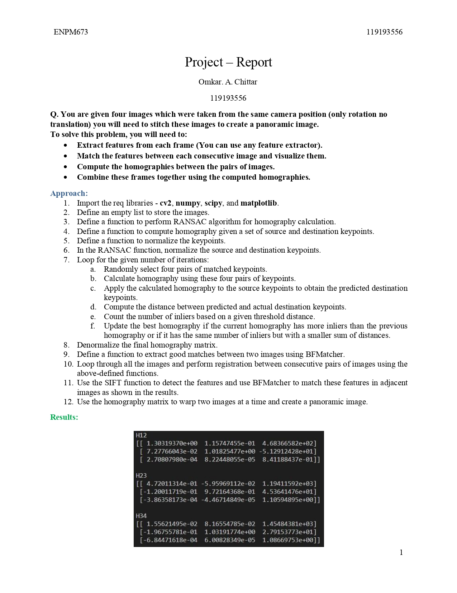
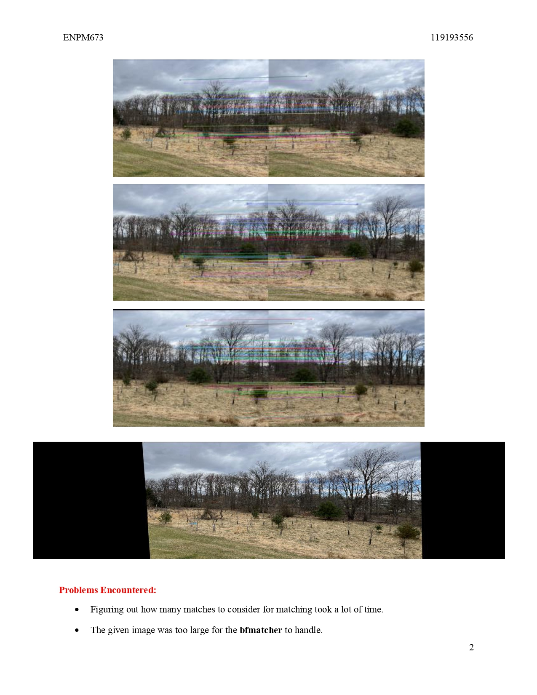

# **Image Stitching**



## **File Tree**

```
Image_Stitching
+-figures
  +- 8 images
+-image_1.jpg
+-image_2.jpg
+-image_3.jpg
+-image_4.jpg
+-Problem
+-README.md
+-report.pdf
```

## **Installation and Running**

1. Download and extract the files.

2. Run the code Problem.py using the following command in your terminal
    ***python3 Problem.py***
4 pop up windows:
**window 1**: Visualization of the matched features between image 1 and 2.
**window 2**: Visualization of the matched features between image 2 and 3.
**window 3**: Visualization of the matched features between image 3 and 4.
**window 4**: Final stitched image.

**The terminal displays the following**:
 - The Homography matrices for image 1 and 2, 2 and 3, 3 and 4 respectively.

***(All the figures in pop up windows are also saved in the figures folder)***

3. A detailed report of the entire project is given in ***report.pdf***  
